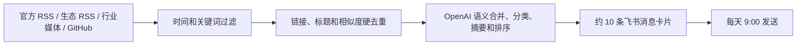

# AI 新闻 Bot

每天自动采集 AI 新闻，完成硬去重、跨来源语义合并、中文摘要、分类和重要性排序，从中精选约 10 条，并在北京时间每天 9:00 发送到飞书“AI 增长内部群”。默认使用 GitHub Actions，因此不需要单独购买服务器。

项目同时包含 `web/` 下的 AI SIGNAL 新闻网页。网页提供分类筛选、关键词搜索、信源优先级和去重方法说明；Bot 每次生成简报时，会自动更新 `web/public/data/latest.json`，网页打开后读取这份最新数据。

## 工作流程



## 信息源策略

信息源配置集中在 `config/sources.yaml`，可以不改代码直接增删。Anthropic 未提供可靠 RSS，因此通过其官方 Newsroom 列表页读取标题、日期、摘要和原文链接；选择权重与其他官方源相同。

| 层级 | 主要来源 | 用途 | 筛选权重 |
| --- | --- | --- | --- |
| 官方 | OpenAI、Anthropic Newsroom、Google DeepMind、Google Developers、NVIDIA、MCP 官方博客 | 模型、产品、协议和重大公司动态 | 最高 |
| 生态/开源 | Hugging Face、GitHub AI、GitHub Changelog、ComfyUI、GitHub Search API | AI 编程、Agent、图片/视频、ComfyUI、MCP、Skill、开源项目 | 高 |
| 行业媒体 | TechCrunch AI、VentureBeat AI、The Decoder | 融资、收购、商业化、政策和行业变化 | 补充 |

GitHub 新项目不是简单抓取 Trending，而是按主题、创建时间和最低 star 数查询；这样结果可复现，也能过滤大量刚创建但没有真实关注度的仓库。

## 分类

- 新模型 `new_models`
- AI 编程 `ai_coding`
- Agent `agents`
- 图片/视频生成 `image_video`
- ComfyUI `comfyui`
- GitHub 开源项目 `open_source`
- MCP `mcp`
- Skill `skills`
- 行业/商业动态 `industry_business`

每条新闻有一个主分类和最多三个辅助分类。每日选择会限制同一公司和同一类别的数量，但重大事件允许例外。

## 时效性规则

1. 每次任务运行都会重新检查全部配置来源，并在网页明确显示“最后检查时间”。
2. 优先选取最近 24 小时内的可靠一手信息；不把抓取时间当成发布时间，没有日期的条目直接跳过。
3. 若近 36 小时内不足约 10 条，自动扩展到最近 7 天补足，并保留每条内容的真实发布日期。
4. 页面会明确区分“近 24 小时有新进展”和“展示最近 7 天重要信息”，不会通过修改日期制造实时感。
5. 全球官方源优先，社区与媒体用于发现新叙事；最终仍按信源质量、新鲜度、影响力和实用性综合排序。

## 去重规则

1. 规范化原始链接：移除 `utm_*` 等跟踪参数、fragment、重复斜杠。
2. 规范化标题：统一大小写和字符，移除 `Introducing`、`Announcing` 等通用发布词。
3. 相似标题合并：标题相似度 ≥ 0.90 或词集合重合度 ≥ 0.82 时保留更权威来源。
4. 语义合并：模型识别“同一事件的不同报道”，优先保留官方原文，其次项目仓库，最后行业媒体。
5. 历史去重：成功发送的链接保留 30 天，避免 GitHub 项目和跨日新闻重复推送。

## 本地运行

需要 Python 3.11 或更新版本。

```bash
python -m venv .venv
source .venv/bin/activate
python -m pip install -e '.[dev]'
cp .env.example .env
```

把 `.env` 中的值加载到当前环境后，可先做不发送的预览：

```bash
ai-news-bot --dry-run
```

不调用 OpenAI、只测试采集和飞书排版：

```bash
ai-news-bot --dry-run --skip-ai
```

正式发送：

```bash
ai-news-bot
```

### 打开新闻网页

网页需要 Node.js 22.13 或更新版本。在另一个终端中运行：

```bash
cd web
pnpm install
pnpm dev
```

默认访问地址为 `http://localhost:3000`。如需把历史简报重新导出给网页，可在运行 Bot 时指定目标路径：

```bash
ai-news-bot --dry-run --web-output web/public/data/latest.json
```

## 接入飞书“AI 增长内部群”

1. 在该群的设置中添加“自定义机器人”，推荐使用 V2 webhook。
2. 开启关键词或签名安全校验；若使用签名校验，复制签名密钥。
3. 不要把 webhook 或密钥提交到仓库。将它们写入 GitHub 仓库的 `Settings → Secrets and variables → Actions`：
   - `OPENAI_API_KEY`
   - `FEISHU_WEBHOOK_URL`
   - `FEISHU_SIGNING_SECRET`（未启用签名时可不创建）
4. 可在 Actions 页面手动运行 `Daily AI News` 做首次验证。

飞书 webhook 会把消息固定发到创建该机器人的群，因此无需在代码中保存群 ID 或群名。消息使用飞书 V2 卡片，每条包含中文标题、简短摘要、分类、来源、重要性和可点击原始链接。

## 每天 9:00 自动发送

`.github/workflows/daily-ai-news.yml` 已配置：

```yaml
schedule:
  - cron: "0 9 * * *"
    timezone: "Asia/Shanghai"
```

工作流只会在默认分支执行。GitHub Actions 在平台高负载时可能有几分钟延迟；若业务要求严格准点，可把同一命令部署到云函数或常驻服务器的 cron。

## 调整筛选

- 每日条数：`TARGET_NEWS_COUNT`，默认 10。
- RSS 回看窗口：`LOOKBACK_HOURS`，默认 36 小时。
- 新闻不足时的补充窗口：`FALLBACK_LOOKBACK_HOURS`，默认 168 小时（7 天）。
- 送入模型的最大候选数：`MAX_CANDIDATES`，默认 80。
- 模型：`OPENAI_MODEL`，默认 `gpt-5.6-luna`，适合高频筛选和摘要。
- 信息源、层级、权重、类别提示、GitHub 查询：`config/sources.yaml`。

## 测试

```bash
pytest
```
