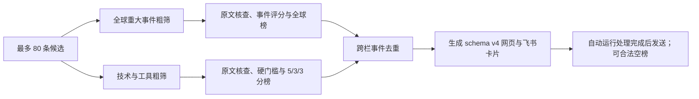

# AI 新闻 Bot

每天自动采集 AI 新闻，通过原文核查、硬门槛、7 天事件去重和确定性评分，将高决策价值内容编入日报，并自动发送到飞书“AI 增长内部群”。日报由“全球 AI 重大事件”和“技术与工具”两条独立编辑流水线组成。每天北京时间 09:05 附近会发起自动运行；实际送达时间取决于平台排队以及采集、模型和飞书处理耗时。默认使用 GitHub Actions，因此不需要单独购买服务器。

项目同时包含 `web/` 下的 AI SIGNAL 新闻网页。网页提供分类筛选、关键词搜索、信源优先级和去重方法说明；Bot 每次生成简报时，会更新本地 `web/public/data/latest.json`，生产工作流仅在飞书发送成功后提交并发布这份数据。

## 工作流程


```mermaid
flowchart LR
    A[最多 80 条候选] --> B1[全球重大事件粗筛]
    A --> B2[技术与工具粗筛]
    B1 --> C1[原文核查、事件评分与全球榜]
    B2 --> C2[原文核查、硬门槛与 5/3/3 分榜]
    C1 --> D[跨栏事件去重]
    C2 --> D
    D --> E[生成 schema v4 网页与飞书卡片]
    E --> F[自动运行处理完成后发送；可合法空榜]
```

## 信息源策略

信息源配置集中在 `config/sources.yaml`，可以不改代码直接增删。Anthropic 未提供可靠 RSS，因此通过其官方 Newsroom 列表页读取标题、日期、摘要和原文链接；选择权重与其他官方源相同。

| 层级 | 主要来源 | 用途 | 筛选权重 |
| --- | --- | --- | --- |
| 官方 | OpenAI、Anthropic Newsroom、Google DeepMind、Google Developers、NVIDIA、MCP 官方博客 | 模型、产品、协议和重大公司动态 | 最高 |
| 生态/开源 | Hugging Face、GitHub AI、GitHub Changelog、ComfyUI、GitHub Search API | AI 编程、Agent、图片/视频、ComfyUI、MCP、Skill、开源项目 | 高 |
| 行业媒体 | TechCrunch AI、VentureBeat AI、The Decoder | 融资、收购、商业化、政策和行业变化 | 补充 |

GitHub 新项目不是简单抓取 Trending，而是按主题、创建时间和最低 star 数查询；这样结果可复现，也能过滤大量刚创建但没有真实关注度的仓库。

## 分类

全球重大事件栏目最多 5 条，覆盖以下五类：

- 模型与产品 `models_products`
- 公司与商业 `companies_business`
- 政策与监管 `policy_regulation`
- 科研突破 `research_breakthroughs`
- 大众应用与社会影响 `adoption_society`

全球事件按影响范围 30、全球相关性 20、时效性 20、证据质量 15、信息增量 10、表达清晰度 5 计分，总分至少 65 才可入选，同一类别最多 2 条。证据必须满足“一个已核验一手来源”或“两个不同域名的独立二手来源”；融资金额、观点、政策方向或科学结论若缺少相应事实与原文，直接淘汰。

技术与工具栏目沿用以下分类：

- 新模型 `new_models`
- AI 编程 `ai_coding`
- Agent `agents`
- 图片/视频生成 `image_video`
- ComfyUI `comfyui`
- GitHub 开源项目 `open_source`
- MCP `mcp`
- Skill `skills`
- 行业/商业动态 `industry_business`

每条新闻有一个主分类和最多三个辅助分类。今日必看和值得试用合计最多选择同一公司两条；三个榜单互斥且不使用低价值内容补足数量，因此一天可以只发少量内容，也可以发送 0 条入选的正常空榜卡。

## 时效性规则

1. 每次任务运行都会重新检查全部配置来源，并在网页明确显示“最后检查时间”。
2. 优先选取最近 24 小时内的可靠一手信息；不把抓取时间当成发布时间，没有日期的条目直接跳过。
3. 若当前窗口没有任何候选通过粗筛，自动扩展到最近 7 天，并保留每条内容的真实发布日期；扩展窗口不会为了凑数填满榜单。
4. 页面会明确区分“近 24 小时有新进展”和“展示最近 7 天重要信息”，不会通过修改日期制造实时感。
5. 全球官方源优先，社区与媒体用于发现新叙事；最终仍按信源质量、新鲜度、影响力和实用性综合排序。

## 去重规则

1. 规范化原始链接：移除 `utm_*` 等跟踪参数、fragment、重复斜杠。
2. 规范化标题：统一大小写和字符，移除 `Introducing`、`Announcing` 等通用发布词。
3. 相似标题合并：标题相似度 ≥ 0.90 或词集合重合度 ≥ 0.82 时保留更权威来源。
4. 事件去重：程序根据主体、产品/模型、变化类型、版本/指标和生效日期生成事件指纹，区分新增、实质更新、轻微更新和重复。
5. 历史去重：查询 URL 历史时忽略超过 30 天的记录；物理清理通常在下一次非空榜成功写入历史时发生。事件指纹按北京时间保留过去 7 天，只有实质更新可以再次入选。

原文抓取只接受无凭据的公网 HTTPS。初始 URL 与每个手动重定向跳各自只解析一次 DNS，全部地址必须是公网地址；实际 TCP 连接固定到本次已校验 IP，同时继续用原域名执行 Host、TLS SNI 和证书主机名校验，且不读取环境代理、认证或 Cookie。媒体层级、未知来源或跨域最终地址不能依靠模型声明获得一手来源资格。每条具体变化都必须绑定原文中的逐字引文，且数字、版本、日期、货币、API 等物料 token 必须一致。

## 本地运行

需要 Python 3.11 或更新版本。

```bash
python -m venv .venv
source .venv/bin/activate
python -m pip install -e '.[dev]'
cp .env.example .env
```

把 `.env` 中的值加载到当前环境后，可先做不发送的预览：

```bash
ai-news-bot --dry-run
```

该命令会采集、核查并生成 schema v4 简报及私密审计，但不会调用飞书，也不会写入成功发送历史。schema v4 的 `published` 状态必须至少包含一条全球事件或技术条目；`no_qualifying_items` 状态下两个栏目都必须为空。确认 `web/public/data/latest.json` 后，使用持久化发送模式：

```bash
ai-news-bot --send-existing
```

如果预览写到了其他位置，生成和发送必须使用同一个路径：

```bash
ai-news-bot --dry-run --web-output /tmp/ai-news-latest.json
ai-news-bot --send-existing --web-output /tmp/ai-news-latest.json
```

`--send-existing` 发送成功后先写入每日发送账本；非空榜再尽力写入 URL 历史和事件历史。具体状态文件、空榜语义、审计检查与安全回滚见 [结构化编辑流水线运维说明](docs/editorial-pipeline.md)。

### 打开新闻网页

网页需要 Node.js 22.13 或更新版本。在另一个终端中运行：

```bash
cd web
pnpm install
pnpm dev
```

默认访问地址为 `http://localhost:3000`。如需把历史简报重新导出给网页，可在运行 Bot 时指定目标路径：

```bash
ai-news-bot --dry-run --web-output web/public/data/latest.json
```

## 接入飞书“AI 增长内部群”

1. 在该群的设置中添加“自定义机器人”，推荐使用 V2 webhook。
2. 开启关键词或签名安全校验；若使用签名校验，复制签名密钥。
3. 在 Cloudflare Dashboard 的 **Workers AI** 页面选择 **Use REST API**，创建 Workers AI API Token 并复制 Account ID。使用预置的 Workers AI API Token 模板，不要使用 Global API Key；若手动创建 Token，只为该 Account 授予 Workers AI 所需的 `Read` 和 `Edit` 权限。Token 与 Account ID 都应只用于此仓库。
4. 不要把 webhook 或密钥提交到仓库。将它们写入 GitHub 仓库的 `Settings → Secrets and variables → Actions → Secrets`：
   - `CLOUDFLARE_ACCOUNT_ID`
   - `CLOUDFLARE_AI_API_TOKEN`
   - `FEISHU_WEBHOOK_URL`
   - `FEISHU_SIGNING_SECRET`（未启用签名时可不创建）
   - `SITE_DIGEST_ENDPOINT`：网页的数据更新接口地址
   - `SITE_BYPASS_TOKEN`：私有网页访问令牌
   - `SITE_DIGEST_UPDATE_SECRET`：网页数据写入密钥
   - `OPENAI_API_KEY`（可选付费备用；只有在 Cloudflare 两项凭证均未配置时才会使用）
5. 可在 `Settings → Secrets and variables → Actions → Variables` 创建可选的 Repository Variable `CLOUDFLARE_AI_MODEL`；不创建时默认使用支持 JSON Mode 的 `@cf/meta/llama-3.1-8b-instruct-fast`。
6. 先在功能分支的 Actions 页面手动运行一次 `Daily AI News`，确认 `Validate AI backend without sending` 成功后再合并。该验证不会发送日报。

Cloudflare Workers AI 是默认后端：只有 `CLOUDFLARE_ACCOUNT_ID` 和 `CLOUDFLARE_AI_API_TOKEN` 两项都存在时才会使用。两项都未配置时，才会使用显式配置的 `OPENAI_API_KEY`；只配置其中一项 Cloudflare 值会使任务失败，避免意外切换后端。ChatGPT 或 GitHub Copilot 订阅不包含 OpenAI API 额度；任何供应商都不能承诺永久免费配额，请在上线前核对当前价格、额度和账户限制。

飞书 webhook 会把消息固定发到创建该机器人的群，因此无需在代码中保存群 ID 或群名。消息使用飞书 V2 卡片，先展示一分钟叙事和全球重大事件，再展示最多 5 条技术与工具信息；标题使用纯文本，原始来源使用单独的明确链接。

### 功能分支无发送验证

在非 `main` 分支上手动运行 `Daily AI News` 时，工作流依次运行 Python 测试、`Validate AI backend without sending`、网页测试并生成离线预览，不会执行日报采集、飞书发送或网页写入。无发送 AI 验证读取 `CLOUDFLARE_ACCOUNT_ID` 和 `CLOUDFLARE_AI_API_TOKEN`，但不会输出它们或调用飞书。对应的本地验证命令为：

```bash
python -m pytest -q
python scripts/build_global_events_preview.py --output-dir validation-output
cd web
npm run lint
npm test
```

产物 `validation-output/latest-v4.json` 和 `validation-output/feishu-card.json` 可以用于评审 schema v4 和卡片布局。该分支验证路径不读取 `FEISHU_WEBHOOK_URL` 或 `FEISHU_SIGNING_SECRET`，因此不能向任何飞书群发送消息。

### 预留的一键总结通道

网页提供只读摘要接口，后续飞书机器人可直接读取统一格式，不需要从页面中抓取文字：

```text
GET /api/summary?period=daily&lang=zh
GET /api/summary?period=weekly&lang=zh
```

接口格式版本为 `ai-signal.summary.v1`，包含摘要周期、生成时间、重大叙事、原始链接和是否启用回看提示。它目前不会主动发送消息，也不会在网页中保存飞书 webhook；正式接入时仍通过 `FEISHU_WEBHOOK_URL` 安全发送到指定群。

## 每日自动触发与发送

生产环境采用双通道触发。触发时间不是送达时间承诺：

1. Cloudflare Worker 的 `repository_dispatch` 和 GitHub Actions 的第一个 `schedule` 都在北京时间 09:05 附近触发。GitHub concurrency 会串行运行它们，但不保证谁先开始或先交付。
2. 北京时间 09:20 的第二个 `schedule` 才是明确的后备触发。
3. 任一自动运行先成功发送并写入每日账本后，其他自动运行会跳过；实际送达可能晚于触发时间。
4. 健康检查应确认当天是否存在任一成功的自动运行以及当天简报是否有效，不应依赖固定的 09:05 主从假设。
5. 手动 `Run workflow` 使用 `workflow_dispatch`，仍可显式补发，但人工操作前必须先排除群消息已送达而账本写入失败的情况。

Cloudflare 只保存仓库专用的 `GITHUB_DISPATCH_TOKEN`，不保存飞书、模型或网页密钥。Worker 的部署和验证步骤见 `cloudflare/ai-news-scheduler/README.md`。

## 调整筛选

- RSS 回看窗口：`LOOKBACK_HOURS`，默认 36 小时。
- 新闻不足时的补充窗口：`FALLBACK_LOOKBACK_HOURS`，默认 168 小时（7 天）。
- 送入模型的最大候选数：`MAX_CANDIDATES`，默认 80。
- 默认模型：`CLOUDFLARE_AI_MODEL`，默认 `@cf/meta/llama-3.1-8b-instruct-fast`；在 GitHub Actions 中可通过同名 Repository Variable 覆盖。
- 可选付费备用模型：`OPENAI_MODEL`，默认 `gpt-5.6-luna`；仅在 Cloudflare 两项凭证都未配置且显式提供 `OPENAI_API_KEY` 时使用。
- `GITHUB_TOKEN` 仅用于 GitHub 采集和工作流操作，不用于模型推理。
- 信息源、层级、权重、类别提示、GitHub 查询：`config/sources.yaml`。

## 测试

```bash
pytest
```
