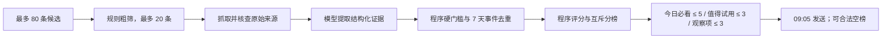

# AI 新闻 Bot

每天自动采集 AI 新闻，通过原文核查、硬门槛、7 天事件去重和确定性评分，将高决策价值内容编入日报，并在北京时间每天 09:05 发送到飞书“AI 增长内部群”。默认使用 GitHub Actions，因此不需要单独购买服务器。

项目同时包含 `web/` 下的 AI SIGNAL 新闻网页。网页提供分类筛选、关键词搜索、信源优先级和去重方法说明；Bot 每次生成简报时，会更新本地 `web/public/data/latest.json`，生产工作流仅在飞书发送成功后提交并发布这份数据。

## 工作流程


```mermaid
flowchart LR
    A[最多 80 条候选] --> B[规则粗筛，最多 20 条]
    B --> C[抓取并核查原始来源]
    C --> D[模型提取结构化证据]
    D --> E[程序硬门槛与 7 天事件去重]
    E --> F[程序评分与互斥分榜]
    F --> G[今日必看 ≤ 5 / 值得试用 ≤ 3 / 观察项 ≤ 3]
    G --> H[09:05 发送；可合法空榜]
```

## 信息源策略

信息源配置集中在 `config/sources.yaml`，可以不改代码直接增删。Anthropic 未提供可靠 RSS，因此通过其官方 Newsroom 列表页读取标题、日期、摘要和原文链接；选择权重与其他官方源相同。

| 层级 | 主要来源 | 用途 | 筛选权重 |
| --- | --- | --- | --- |
| 官方 | OpenAI、Anthropic Newsroom、Google DeepMind、Google Developers、NVIDIA、MCP 官方博客 | 模型、产品、协议和重大公司动态 | 最高 |
| 生态/开源 | Hugging Face、GitHub AI、GitHub Changelog、ComfyUI、GitHub Search API | AI 编程、Agent、图片/视频、ComfyUI、MCP、Skill、开源项目 | 高 |
| 行业媒体 | TechCrunch AI、VentureBeat AI、The Decoder | 融资、收购、商业化、政策和行业变化 | 补充 |

GitHub 新项目不是简单抓取 Trending，而是按主题、创建时间和最低 star 数查询；这样结果可复现，也能过滤大量刚创建但没有真实关注度的仓库。

## 分类

- 新模型 `new_models`
- AI 编程 `ai_coding`
- Agent `agents`
- 图片/视频生成 `image_video`
- ComfyUI `comfyui`
- GitHub 开源项目 `open_source`
- MCP `mcp`
- Skill `skills`
- 行业/商业动态 `industry_business`

每条新闻有一个主分类和最多三个辅助分类。今日必看和值得试用合计最多选择同一公司两条；三个榜单互斥且不使用低价值内容补足数量，因此一天可以只发少量内容，也可以发送 0 条入选的正常空榜卡。

## 时效性规则

1. 每次任务运行都会重新检查全部配置来源，并在网页明确显示“最后检查时间”。
2. 优先选取最近 24 小时内的可靠一手信息；不把抓取时间当成发布时间，没有日期的条目直接跳过。
3. 若当前窗口没有任何候选通过粗筛，自动扩展到最近 7 天，并保留每条内容的真实发布日期；扩展窗口不会为了凑数填满榜单。
4. 页面会明确区分“近 24 小时有新进展”和“展示最近 7 天重要信息”，不会通过修改日期制造实时感。
5. 全球官方源优先，社区与媒体用于发现新叙事；最终仍按信源质量、新鲜度、影响力和实用性综合排序。

## 去重规则

1. 规范化原始链接：移除 `utm_*` 等跟踪参数、fragment、重复斜杠。
2. 规范化标题：统一大小写和字符，移除 `Introducing`、`Announcing` 等通用发布词。
3. 相似标题合并：标题相似度 ≥ 0.90 或词集合重合度 ≥ 0.82 时保留更权威来源。
4. 事件去重：程序根据主体、产品/模型、变化类型、版本/指标和生效日期生成事件指纹，区分新增、实质更新、轻微更新和重复。
5. 历史去重：成功发送的链接保留 30 天，事件指纹按北京时间保留过去 7 天；只有实质更新可以再次入选。

## 本地运行

需要 Python 3.11 或更新版本。

```bash
python -m venv .venv
source .venv/bin/activate
python -m pip install -e '.[dev]'
cp .env.example .env
```

把 `.env` 中的值加载到当前环境后，可先做不发送的预览：

```bash
ai-news-bot --dry-run
```

该命令会采集、核查并生成 schema v3 简报及私密审计，但不会调用飞书，也不会写入成功发送历史。确认 `web/public/data/latest.json` 后，使用持久化发送模式：

```bash
ai-news-bot --send-existing
```

如果预览写到了其他位置，生成和发送必须使用同一个路径：

```bash
ai-news-bot --dry-run --web-output /tmp/ai-news-latest.json
ai-news-bot --send-existing --web-output /tmp/ai-news-latest.json
```

`--send-existing` 发送成功后先写入每日发送账本；非空榜再尽力写入 URL 历史和事件历史。具体状态文件、空榜语义、审计检查与安全回滚见 [结构化编辑流水线运维说明](docs/editorial-pipeline.md)。

### 打开新闻网页

网页需要 Node.js 22.13 或更新版本。在另一个终端中运行：

```bash
cd web
pnpm install
pnpm dev
```

默认访问地址为 `http://localhost:3000`。如需把历史简报重新导出给网页，可在运行 Bot 时指定目标路径：

```bash
ai-news-bot --dry-run --web-output web/public/data/latest.json
```

## 接入飞书“AI 增长内部群”

1. 在该群的设置中添加“自定义机器人”，推荐使用 V2 webhook。
2. 开启关键词或签名安全校验；若使用签名校验，复制签名密钥。
3. 不要把 webhook 或密钥提交到仓库。将它们写入 GitHub 仓库的 `Settings → Secrets and variables → Actions`：
   - `FEISHU_WEBHOOK_URL`
   - `FEISHU_SIGNING_SECRET`（未启用签名时可不创建）
   - `SITE_DIGEST_ENDPOINT`：网页的数据更新接口地址
   - `SITE_BYPASS_TOKEN`：私有网页访问令牌
   - `SITE_DIGEST_UPDATE_SECRET`：网页数据写入密钥
   - `OPENAI_API_KEY`（可选；未配置时自动使用 GitHub Models）
4. 可在 Actions 页面手动运行 `Daily AI News` 做首次验证。

飞书 webhook 会把消息固定发到创建该机器人的群，因此无需在代码中保存群 ID 或群名。消息使用飞书 V2 卡片，按“今日必看”“值得试用”“观察项”显示具体变化、影响对象、影响内容、建议行动、分数和可核查原文链接。

### 预留的一键总结通道

网页提供只读摘要接口，后续飞书机器人可直接读取统一格式，不需要从页面中抓取文字：

```text
GET /api/summary?period=daily&lang=zh
GET /api/summary?period=weekly&lang=zh
```

接口格式版本为 `ai-signal.summary.v1`，包含摘要周期、生成时间、重大叙事、原始链接和是否启用回看提示。它目前不会主动发送消息，也不会在网页中保存飞书 webhook；正式接入时仍通过 `FEISHU_WEBHOOK_URL` 安全发送到指定群。

## 每天 09:05 自动发送

生产环境采用双通道触发：

1. Cloudflare Worker 在每天北京时间 09:05 调用 GitHub `repository_dispatch`，作为准点主触发。
2. GitHub Actions 保留北京时间 09:05 和 09:20 两个原生 `schedule`，作为平台级备用。
3. 自动运行先生成日报、发送已持久化结果，再提交并发布当天网页数据；`schedule` 与 `repository_dispatch` 共用成功发送账本，后续自动运行直接跳过。
4. 手动 `Run workflow` 使用 `workflow_dispatch`，仍可显式补发。

Cloudflare 只保存仓库专用的 `GITHUB_DISPATCH_TOKEN`，不保存飞书、模型或网页密钥。Worker 的部署和验证步骤见 `cloudflare/ai-news-scheduler/README.md`。

## 调整筛选

- RSS 回看窗口：`LOOKBACK_HOURS`，默认 36 小时。
- 新闻不足时的补充窗口：`FALLBACK_LOOKBACK_HOURS`，默认 168 小时（7 天）。
- 送入模型的最大候选数：`MAX_CANDIDATES`，默认 80。
- 模型：`OPENAI_MODEL`，默认 `gpt-5.6-luna`，适合高频筛选和摘要。
- GitHub Actions 在未配置 `OPENAI_API_KEY` 时，会使用工作流自带的 `GITHUB_TOKEN` 调用 GitHub Models；默认模型为 `openai/gpt-4o-mini`，无需额外 API Key。
- 信息源、层级、权重、类别提示、GitHub 查询：`config/sources.yaml`。

## 测试

```bash
pytest
```
